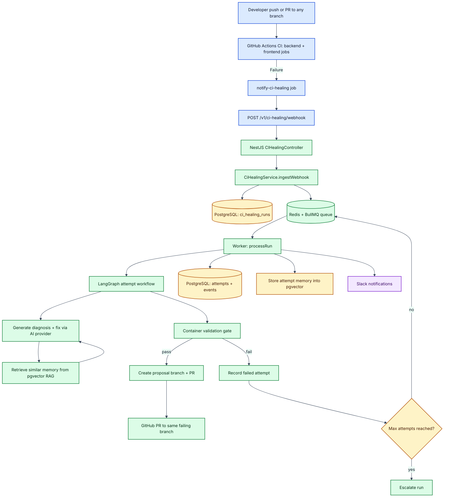

# ci-fix-pilot — Self-Healing CI Demo Platform

This repository demonstrates an AI-assisted self-healing CI flow for frontend/backend failures:

1. CI fails on any branch
2. GitHub Actions posts failure context to the CI-healing webhook
3. Backend agent runs diagnosis + retry loop
4. Container validation gate runs before PR creation
5. Agent opens a PR into the same failing branch if fix proposal succeeds

---

## Repository Layout

- `backend-coe/nestjs`: NestJS backend, queue workers, CI-healing engine
- `frontend-coe`: Next.js frontend/dashboard
- `.github/workflows/ci.yml`: primary CI + failure notification to CI-healing webhook
- `solution-idea.md`: original proposed architecture and scope
- `ENV_SETUP_CIHEALING.md`: env setup and troubleshooting guide

---

## Current CI Healing Flow

### Trigger

- Workflow: `.github/workflows/ci.yml`
- Trigger branches: all branches (push + pull_request)
- On backend/frontend job failure, `notify-ci-healing` sends webhook payload to backend

### Payload content

The workflow now includes:

- `repository`, `branch`, `commitSha`, `pipelineUrl`
- `errorType=workflow_failure`
- compact failed job names + failed step names in `errorLog`

### PR targeting behavior

In `backend-coe/nestjs/src/ci-healing/ci-healing.service.ts`:

- agent validates container checks before PR (`validateInContainer`)
- agent re-checks failing branch head SHA before PR
- if branch moved since failure, PR is skipped (`pr.skipped` event)
- if still same failing commit, PR is opened into that same branch

---

## App Flow & Architecture

### End-to-end runtime flow



### Component architecture

```mermaid
%%{init: {
	"theme": "base",
	"themeVariables": {
		"fontFamily": "Inter, Segoe UI, Roboto, Arial",
		"fontSize": "14px",
		"primaryColor": "#EEF2FF",
		"primaryTextColor": "#111827",
		"primaryBorderColor": "#4338CA",
		"lineColor": "#374151",
		"clusterBkg": "#F8FAFC",
		"clusterBorder": "#CBD5E1"
	}
}}%%
flowchart LR
	subgraph CI[GitHub CI Layer]
		GH[GitHub Actions]
		WF[.github/workflows/ci.yml]
	end

	subgraph API[Backend API and Worker Layer (NestJS)]
		CTRL[CIHealingController]
		SVC[CIHealingService]
		Q[CiHealingQueue / BullMQ]
		W[Queue Worker]
		LG[LangGraph Orchestrator]
		AI[AiService Providers]
		RAG[RagService]
		MET[CiHealingMetricsService]
	end

	subgraph DATA[Data Layer]
		PG[(PostgreSQL + Drizzle)]
		VEC[(pgvector embeddings)]
		REDIS[(Redis)]
	end

	subgraph EXT[External Integrations]
		SLACK[Slack Webhook]
		GITHUB[GitHub API]
		DOCKER[Container validation command]
	end

	WF --> CTRL
	CTRL --> SVC
	SVC --> Q
	Q --> W
	W --> SVC
	SVC --> LG
	LG --> AI
	LG --> RAG
	RAG --> VEC
	SVC --> PG
	SVC --> REDIS
	SVC --> MET
	SVC --> SLACK
	SVC --> GITHUB
	SVC --> DOCKER

	classDef ci fill:#DBEAFE,stroke:#1E40AF,color:#0F172A,stroke-width:1.5px;
	classDef api fill:#DCFCE7,stroke:#166534,color:#052E16,stroke-width:1.5px;
	classDef data fill:#FEF3C7,stroke:#92400E,color:#451A03,stroke-width:1.5px;
	classDef ext fill:#FCE7F3,stroke:#9D174D,color:#500724,stroke-width:1.5px;

	class GH,WF ci;
	class CTRL,SVC,Q,W,LG,AI,RAG,MET api;
	class PG,VEC,REDIS data;
	class SLACK,GITHUB,DOCKER ext;
```

### Tool-by-tool execution map

| Tool / Layer | Where used | Purpose in flow |
|---|---|---|
| GitHub Actions | `.github/workflows/ci.yml` | Detects pipeline failures and emits webhook payload |
| Webhook API | `CIHealingController.ingestWebhook` | Accepts failure event and enqueues run |
| PostgreSQL | `ci_healing_*` tables | Persistent run/attempt/event audit trail |
| Redis + BullMQ | queue modules in backend | Retry-safe asynchronous run processing |
| LangGraph | `runAttemptWorkflow` | Orchestrates generate/validate state transitions |
| AI Providers | `AiService` | Generates diagnosis + fix proposal |
| pgvector memory | `RagService` + `RagRepository` | Retrieves and stores similar fix patterns |
| Container validation | `validateInContainer` | Safety gate before PR creation |
| GitHub API | `createProposalPullRequest` | Creates branch + PR to failing branch |
| SSE stream | `GET /v1/ci-healing/stream` | Pushes run timeline updates to dashboard without polling |
| Slack | `notifySlack` | Status notifications for queue/attempt/PR/escalation |
| Metrics | `CiHealingMetricsService` | Operational counters for observability |

---

## Slack Integration (Where It Is Implemented)

### Core implementation

- `backend-coe/nestjs/src/ci-healing/ci-healing.service.ts`
	- method: `notifySlack(message: string)`
	- env read: `CI_HEALING_SLACK_WEBHOOK_URL`

### Slack events emitted

- pipeline failure queued
- attempt started / retry
- run fixed / escalated
- PR opened / merged / closed
- PR skipped when branch no longer matches failing commit

### Env wiring

- `backend-coe/nestjs/src/config/env-config.module.ts`
	- includes `CI_HEALING_SLACK_WEBHOOK_URL` in config mapping + schema

---

## CI Healing APIs

- `POST /v1/ci-healing/webhook` — ingest CI failure event
- `GET /v1/ci-healing/stream` — realtime server-sent event stream for dashboard updates
- `GET /v1/ci-healing/runs` — list runs
- `GET /v1/ci-healing/runs/:id` — full run details with attempts/events
- `GET /v1/ci-healing/runs/:id/memory` — per-attempt memory matches used during diagnosis
- `POST /v1/ci-healing/runs/:id/actions/:action` — reviewer actions (`approve|deny|abort|human-fix`)
- `GET /v1/ci-healing/metrics/summary` — summary counters
- `GET /v1/ci-healing/metrics/repositories` — repo-level metrics

---

## Required Configuration

### GitHub Actions Secrets

- `CI_HEALING_WEBHOOK_URL` (required)
- `CI_HEALING_WEBHOOK_SECRET` (optional, recommended)

### Backend `.env` essentials

- `CI_HEALING_ENABLED=true`
- `CI_HEALING_GITHUB_ENABLED=true`
- `GITHUB_TOKEN=...`
- `CI_HEALING_CONTAINER_VALIDATION_REQUIRED=true`
- `CI_HEALING_CONTAINER_VALIDATE_COMMAND=bash scripts/ci-healing-container-validate.sh`
- `CI_HEALING_SLACK_WEBHOOK_URL=...`
- one active AI provider credential (Anthropic or OpenAI-compatible)

See `ENV_SETUP_CIHEALING.md` for full list.

---

## Realtime Decision: SSE over WebSocket

For this project, realtime UI updates are **server → dashboard only** (event feed/timeline updates). We chose **SSE** instead of WebSocket because it better fits that traffic pattern:

1. **One-way stream is enough:** dashboard only needs pushed CI-healing events; command actions remain normal REST calls.
2. **Lower operational complexity:** SSE is plain HTTP, simpler through proxies/load balancers, and easier to debug with curl.
3. **Built-in reconnect behavior:** browser `EventSource` auto-reconnects without custom socket retry logic.
4. **Safer incremental rollout:** we already had stable REST endpoints; SSE layers on top without replacing existing APIs.
5. **WebSocket still available if needed:** backend already includes a Socket.IO gateway, but bi-directional transport is unnecessary for current CI-healing workflow.

If future requirements need bi-directional collaboration (multi-user cursors/chat/interactive controls), WebSocket can be added for those channels while keeping SSE for timeline fan-out.

---

## Technology Coverage vs `solution-idea.md`

| Technology in idea | Status in repo | Notes |
|---|---|---|
| NestJS | ✅ Used | Backend lives in `backend-coe/nestjs` |
| Next.js | ✅ Used | Frontend in `frontend-coe` |
| TailwindCSS + shadcn/ui | ✅ Used | Frontend stack and UI components present |
| Redis + BullMQ | ✅ Used | Queue processing for CI-healing attempts |
| PostgreSQL | ✅ Used | Runtime DB and CI services use Postgres |
| Anthropic Claude | ✅ Used | Default CI-healing AI provider |
| Slack webhook | ✅ Used | `notifySlack` integration in CI-healing service |
| LangGraph | ✅ Used | CI-healing attempt orchestration now uses LangGraph with native fallback |
| ChromaDB (RAG memory) | ⚠️ Not used | Replaced by existing pgvector-backed RAG memory in PostgreSQL |
| Prisma | ❌ Not used | Existing backend uses Drizzle ORM; stayed consistent to avoid ORM migration risk |

### Why some planned technologies are not yet used

1. **Codebase fit:** backend already had Drizzle-based data layer and queue patterns.
2. **Delivery speed:** implementing stable webhook→retry→validation→PR flow was prioritized first.
3. **Risk control:** keeping Drizzle + PostgreSQL/pgvector avoided ORM migration and reduced implementation risk.

---

## Suggested Next Steps

1. Add LangGraph state visualization/tracing for each run attempt.
2. Expand pgvector memory retrieval with metadata filters per repository/branch.
3. Decide ORM direction:
	 - keep Drizzle and update idea doc, or
	 - migrate CI-healing module to Prisma if strict alignment is required.

---

## Local Verification Quick Commands

```bash
# backend
cd backend-coe/nestjs
pnpm run db:migrate
pnpm run api:start
pnpm run worker:start

# frontend
cd ../../frontend-coe
pnpm dev
```

Trigger CI-healing manually:

```bash
curl -X POST http://localhost:3002/v1/ci-healing/webhook \
	-H "Content-Type: application/json" \
	-d '{
		"provider":"github",
		"repository":"charan-happy/ci-fix-pilot",
		"branch":"feature/my-failing-branch",
		"commitSha":"<sha>",
		"errorType":"workflow_failure",
		"errorLog":"manual failure payload"
	}'
```